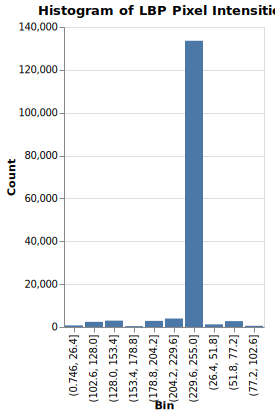
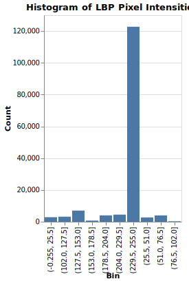
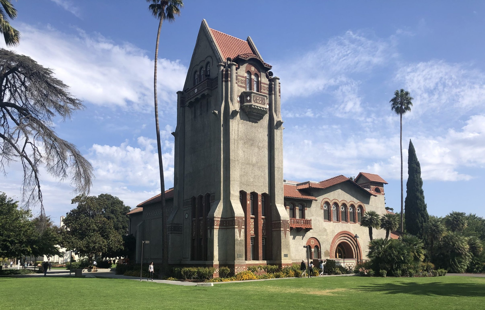
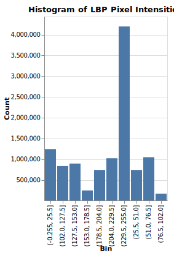

# LBP Image Analysis
Data Mining Assignment for CMPE 256 at SJSU

Using the lbp.py script/functions in the demo_from_class directory

 > credit: Chandrasekar Vuppalapati, San Jose State Univ. CMPE 256

LBP Image Analysis was ran on these following images, and interactive histograms created with Altair:

**SJSU Logo in Color**

**SJSU Logo in Greyscale**

**Photograph taken at SJSU**

